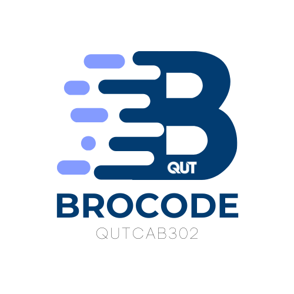

<p align="center">
    
</p>

# Digital Fortune Cookies for Students

## Overview
Digital Fortune Cookies for Students is a Java-based desktop application developed by the **BroCode** team for the CAB302 Software Development course at QUT (Semester 1, 2025). It enhances the learning experience by delivering personalized study tips, motivational quotes, and fun predictions through an intuitive JavaFX interface. The app tracks learning progress against user-defined study goals, with AI-generated content tailored to time spent studying or remaining time, making studying engaging and motivating. **User stories** drive features like setting study goals, tracking study hours, and providing time-based feedback to support student progress. Built using an **Agile methodology**, the project employs **Object-Oriented Design (OOD)**, **Test-Driven Development (TDD)**, and **GitHub** for version control, aligning with industry standards (ACS CBOK: 1, 1.2-1.4, 1.6; SFIA: PROG).

The application leverages **Grok-3-Mini-Fast** (developed by xAI) for AI-generated content, integrated through a robust **API** in the `com/example/project/api/` package. The API facilitates dynamic communication with Grok-3-Mini-Fast to deliver personalized motivational sentences, study tips, and predictions with optimized performance for rapid response times. **Gson**, a Java JSON library, ensures efficient serialization of prompt data into JSON for API requests and deserialization of JSON responses into Java objects, enabling seamless and reliable data exchange. The Week 9 preliminary prototype includes a functional GUI, user authentication, SQLite persistence, and unit tests, with a complete feature set targeted for Week 13.

<p align="center">
    
</p>

## Features
- **Personalized Study Tips**: AI-generated advice customized to study habits, progress, and time spent or remaining toward user goals.
- **Motivational Quotes**: Tailored inspirational quotes based on study time or objectives.
- **Fun Predictions**: Playful predictions linked to learning progress to maintain user engagement.
- **Progress Tracking**: Monitors study time and progress against user-defined goals.
- **User Authentication**: Secure sign-up/sign-in system with GUI and data models.
- **Data Persistence**: Stores user data in a SQLite `.db` file for accounts and progress.
- **Graphical User Interface**: User-friendly JavaFX-based interface with responsive design.
- **API Communication with Grok-3-Mini-Fast**:
    - **Input**: The application constructs a dynamic prompt sent to the Grok-3-Mini-Fast API via the `com/example/project/api/` package. The prompt includes:
        - **User Data**: Preferred name (used occasionally), language, fortune cookie preference, learning progress (e.g., "2 hours 30 minutes remaining out of 10.00 hours chosen"), location, job, and gender, if available.
        - **Context**: Tailored details about the user’s academic and personal circumstances to inform the AI’s response.
        - **Instructions**: Requests a single motivational sentence, with a randomly selected focus (e.g., learning progress, location, or academic journey) and varied sentence length.
        - **Serialization**: Gson serializes the prompt and API parameters into a JSON payload for the request to `https://api.x.ai/v1/chat/completions`, authenticated with an API key.
    - **Output**: The API returns a JSON response, deserialized by Gson into a Java object, containing a single motivational sentence (e.g., "Your dedication to learning will open new opportunities."). The sentence is displayed in the UI with a fade-in animation. The response may include metadata (e.g., response ID), but only the sentence is used.

## Technologies Used
- **Java**: Core programming language; Amazon Corretto 21 strongly recommended.
- **JavaFX**: Framework for building the graphical interface (version 21 recommended).
- **Grok-3-Mini-Fast**: AI model by xAI for generating personalized content, integrated via API. Gson serializes prompt data into JSON requests and deserializes JSON responses into Java objects for reliable data handling.
- **Gson**: Java JSON library for efficient serialization and deserialization of data in API communication with Grok-3-Mini-Fast, ensuring seamless exchange of prompts and responses.
- **Persistence**: SQLite `.db` file for lightweight user data storage.
- **JUnit**: Unit testing for code reliability (JUnit 5).
- **Maven**: Dependency and build management (version 3.8+ recommended).
- **Git**: Version control with branching workflow via GitHub.

## Installation
### Prerequisites
- **Java Development Kit (JDK)**: Amazon Corretto 21 strongly recommended, available at [AWS Corretto Downloads](https://docs.aws.amazon.com/corretto/latest/corretto-21-ug/downloads-list.html); 
- **JavaFX SDK**: Version 21 recommended.
- **Maven**: For dependency management.
- **Git**: For cloning the repository.

### Steps
1. **Clone the Repository**:
   ```bash
   git clone https://github.com/BroCode-QUT-CAB302-25s1/Digital-Fortune-Cookies-for-Students.git
   cd Digital-Fortune-Cookies-for-Students
   ```

2. **Configure JavaFX**:
    - Download JavaFX SDK from [Gluon](https://gluonhq.com/products/javafx/).
    - Configure in your IDE (e.g., IntelliJ IDEA, Eclipse) or update Maven `pom.xml`.

3. **Install Dependencies**:
   ```bash
   mvn clean install
   ```

4. **Run the Application**:
    - The SQLite `.db` file is automatically created on first run if it does not exist.
   ```bash
   mvn javafx:run
   ```

## Usage
1. **Sign Up/Sign In**: Create a new account or log into an existing one.
2. **Set Study Targets**: Define goals (e.g., weekly study hours).
3. **Receive Daily Messages**: View tailored tips, quotes, and predictions based on study time or remaining goals.
4. **Track Progress**: Log study hours to monitor progress toward targets.
5. **Explore Interface**: Navigate JavaFX windows to access features and settings.

## Project Structure
```
Digital-Fortune-Cookies-for-Students/
├── src/
│   ├── main/
│   │   ├── java/
│   │   │   └── com/example/project/
│   │   │       ├── controller/    # JavaFX controllers for UI logic
│   │   │       ├── dao/           # Data Access Objects for database operations
│   │   │       ├── database/      # Database connection and initialization
│   │   │       ├── model/         # Data models (e.g., User, StudyProgress)
│   │   │       ├── util/          # Utility classes and helpers
│   │   │       ├── api/           # API integration with Grok-3-Mini-Fast for AI-generated content
│   │   │       ├── MainApplication.java  # Application entry point
│   │   │       └── module-info.java      # Java module configuration
│   │   └── resources/
│   │       └── com/example/project/
│   │           ├── fxml/          # FXML files for UI layout
│   │           ├── images/        # Image assets
│   │           ├── style/         # CSS styles for JavaFX UI
│   │           └── symbol/        # Logo and icon files (e.g., digitalCookieMainIcon2.png)
│   └── test/
│       └── java/                  # JUnit tests for application logic
├── README.md                      # Project documentation (this file)
├── pom.xml                        # Maven configuration
└── userData.db                    # SQLite database file for user data storage
```

## Contributing
This project is developed by the **BroCode** team for CAB302. Team members can contribute by:
1. Creating a feature branch (`git checkout -b feature/name`).
2. Implementing and testing changes.
3. Submitting a pull request with a clear description of changes.

## License
This project is for educational purposes only and is not distributed under a specific license. All code and resources are intended for use within the CAB302 course at QUT.

## Contact
For questions or support, contact the **BroCode** team via:
- **Antares (Van Thien Phuoc Mai)**: overlimit090@gmail.com
- **GitHub**: [BroCode-QUT-CAB302-25s1/Digital-Fortune-Cookies-for-Students](https://github.com/BroCode-QUT-CAB302-25s1/Digital-Fortune-Cookies-for-Students)
- QUT course channels (e.g., Microsoft Teams)

## Acknowledgments
- QUT CAB302 teaching team for guidance and resources.
- JavaFX and SQLite communities for development support.
- Gluon for JavaFX SDK distribution.
- xAI for Grok-3-Mini-Fast, powering AI content generation.

https://github.com/BroCode-QUT-CAB302-25s1/Digital-Fortune-Cookies-for-Students.git
